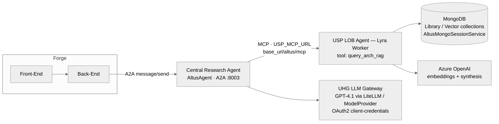
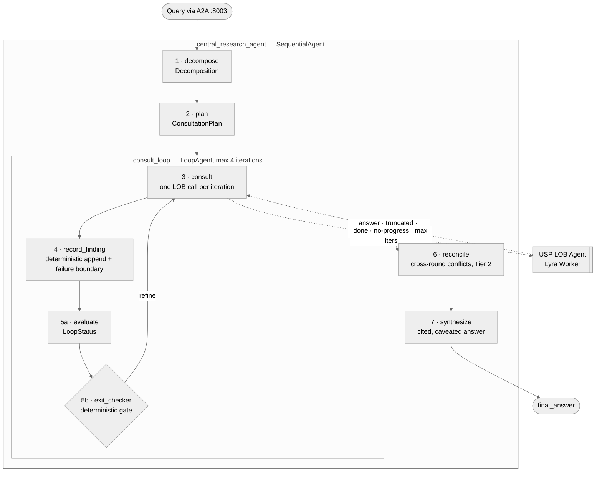
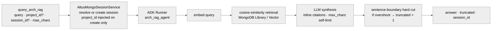
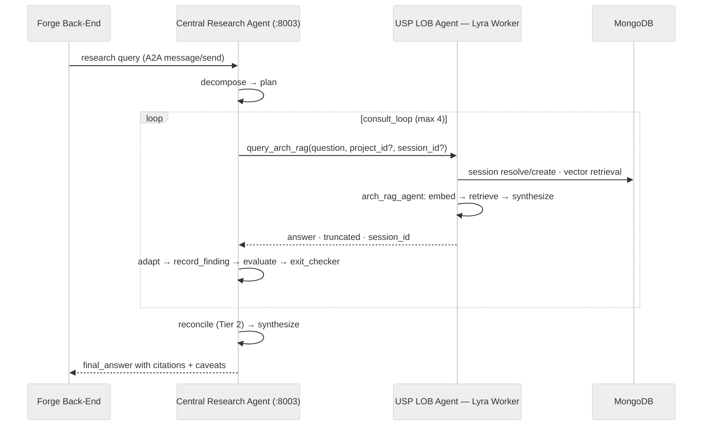

# Research Agent / Context Engine — Technical Design

**Feature:** F1872578 — Research Agent / Context Engine MVP with Central Orchestration and USP Pilot LOB Isolation
**Stack:** Google ADK · Altus AI Framework · A2A (a2a-sdk 0.x) · MCP (FastMCP) · Azure OpenAI GPT-4.1 via UHG LLM Gateway (LiteLLM)

---

## 1. Purpose and scope

This module implements the central Research Agent (RA) operating model for federated, iterative research across domain-owned knowledge systems. The RA owns planning, orchestration, iterative refinement, cross-round conflict reconciliation, and final synthesis. It owns no domain knowledge: all retrieval, ranking, and domain reasoning stay inside LOB-owned agents, reached through one coarse-grained tool call per LOB.

USP is the pilot LOB, served by **Lyra Worker** (`cirrus-apps_altus-forge-lyra-worker`, a.k.a. "Forge Lyra"): an MCP service backed by MongoDB Library/Vector collections and Azure OpenAI for embeddings and synthesis. The RA consults it through a single tool, `query_arch_rag`, mounted at `/altus/mcp`.

**Federation principle:** the RA never sees raw documents and never issues fine-grained `search_*` calls. It asks a question; the LOB returns a finished, synthesized, cited answer. Retrieval, ranking, and conflict policy remain inside the LOB boundary, keeping domain knowledge localized and auditable. Onboarding a new LOB touches only the plan step's routing — the loop, evaluator, and reconciliation logic are domain-agnostic.

## 2. System context



Both deployable services are AltusAgent instances, which supplies the mandatory AgentCard + AgentSkill, the safety prompt, security-client integration, and event publishing. Internal pipeline steps (decompose, plan, consult, evaluate, reconcile, synthesize, plus the deterministic record_finding and exit_checker) are plain ADK agents inside one service — implementation details of the RA, not peers, and not separately exposed.

## 3. Central Research Agent — pipeline design

The RA is a `SequentialAgent` of seven steps with a `LoopAgent` embedded for the consultation cycle. LLM judgment and control flow are deliberately separated: every decision that terminates or repeats work is made by deterministic code (`BaseAgent`), never by sampling.



**Step responsibilities** (files under `central_research_agent/service/sub_agents/`):

| Step | Agent | Kind | Output (state key) |
|---|---|---|---|
| 1 | decompose | LlmAgent | `decomposition` — 1–3 self-contained sub-questions |
| 2 | plan | LlmAgent | `plan` — domain + order per sub-question; the only step that grows when a new LOB onboards |
| 3 | consult | LlmAgent + tool | `last_finding` — raw JSON from exactly one LOB call per iteration |
| 4 | record_finding | BaseAgent | appends to `findings`; parse failure → synthetic `coverage="none"` finding instead of a crash |
| 5a | evaluate | LlmAgent | `loop_status` — `{verdict: done|refine, reasons[], refined_question?}` via ordered rules: missing coverage → conflict → competing claims → unanswered plan step → done |
| 5b | exit_checker | BaseAgent | escalates out of the loop on `done`, no-progress (SHA-256 of findings repeats), or framework max-iterations |
| 6 | reconcile | LlmAgent | `reconciliation` — evidence-strength priority: deployment/production > code > docs; newer > older |
| 7 | synthesize | LlmAgent | `final_answer` — cites sources, states resolved conflicts, caveats limitations |

**State model.** All cross-step data lives in ADK session state via `state_delta`, scoped to a single run: `original_query`, `decomposition`, `plan`, `findings`, `finding_hashes`, `loop_status`, `loop_exit`, `reconciliation`, `final_answer`, plus the LOB `session_id` (§7). The RA's A2A server is stateless across HTTP requests — each incoming message starts a fresh session.

## 4. Federation contract

### 4.1 The LOB tool

```python
query_arch_rag(
    query: str,               # natural-language question
    project_id: str | None,   # optional P-prefixed scope; applied only at session creation
    session_id: str | None,   # continue an existing multi-turn session; new one created if absent
    max_chars: int = 4000,    # response budget; LLM self-limits, sentence-boundary hard cut as backstop
) -> {"answer": str, "truncated": 0 | 1, "session_id": str}
```

The answer arrives fully synthesized with inline `[filename](url)` citations — a finished answer, not raw chunks, because the calling RA is an orchestrator collecting completed findings from specialized agents before making its own decision.

### 4.2 Internal finding shape and adapter

The consult step normalizes each LOB response into the pipeline's internal finding shape so the evaluator and exit logic read structured signals rather than judging prose:

| Internal field | Derivation from `query_arch_rag` response |
|---|---|
| `finding` | `answer` verbatim |
| `evidence[]` | inline `[filename](url)` citations parsed in order of appearance |
| `coverage` | `partial` if `truncated == 1` or the answer is a recognizable non-answer; else `full` |
| `confidence` | `high` when ≥1 citation and not truncated; `medium` otherwise; `low` for non-answers |
| `session_id` | stored in RA state, echoed on subsequent iterations of the same run |

**Proposed contract v2** (filed as a Lyra Worker enhancement): add `coverage`, `confidence`, and `unresolved_conflicts[]` to the tool response, so Tier-1 conflicts among the LOB's own sources are surfaced to the RA as structured escalations rather than blended silently into the synthesis. Until then, conflict detection at the RA operates on cross-round contradictions only (§6).

## 5. USP LOB Agent — Lyra Worker

Only Lyra's MCP surface (`app/api/mcp/server.py`) is in this workspace; the `arch_rag_agent` internals, Celery workers, and FastAPI routes live in the fuller Lyra codebase.

**Transport and mount:** FastMCP (server name `arch-rag`), streamable HTTP, exported as a pre-built ASGI app (`mcp_http_app = mcp.streamable_http_app()`) mounted at `/altus/mcp` on the service's FastAPI app.

**Request lifecycle:**



Retrieval, ranking, and synthesis all happen inside the Lyra boundary — the RA receives only the finished result. Sessions are MongoDB-persisted and resumable via `session_id`, surviving process restarts and shared across replicas.

## 6. Conflict handling — two tiers

Tier 1 lives inside the LOB: when Lyra's sources disagree, its synthesis resolves the disagreement as part of producing one answer. Today that resolution is implicit (contract v2 would make unresolved cases explicit). Tier 2 lives in the RA's reconcile step: after the loop ends, findings from different rounds are compared, contradictions identified, and each resolved using an evidence-strength priority — deployment/production evidence over code behavior over documentation, newer over older — with the winning source named. Reconciliation is a separate, auditable step rather than a clause inside the synthesis prompt, so conflict handling is visible in the event trace instead of buried in one LLM call. Genuinely unresolvable contradictions are stated as such in the final answer, never papered over.

## 7. Session and scoping strategy

One Lyra session per RA research run. The first consult iteration omits `session_id` and supplies `project_id`; Lyra creates the session and returns its id, which the RA stores in state and echoes on every subsequent iteration of that run, then discards when the run ends. This gives Lyra conversational context across refinement rounds — improving answers to refined questions — while keeping the RA itself stateless across requests.

Two consequences worth stating explicitly. First, `project_id` must be resolved **before iteration 1**: Lyra applies it only at session creation, so late binding is impossible without abandoning the session. Second, within a run the LOB is deliberately stateful; across runs, nothing is shared.

## 8. Runtime sequence



## 9. Security and compliance

AltusAgent supplies the mandated AgentCard + at least one AgentSkill per deployable service (`federated_research` on the RA; the USP research skill on the LOB agent), plus the safety prompt and event publishing — verified live by `a2a_smoke_test.py`. `common/security.py` currently ships a dev-only `AllowAllSecurityClient`, to be replaced by the real OIDC client in production. LLM access is via the UHG LLM Gateway with OAuth2 client-credentials (`LLM_GATEWAY_CLIENT_ID/SECRET/PROJECT_ID`); no raw Azure keys in the services. Lyra currently has no auth middleware (network-level isolation assumed; an API-key header guard is called out before external exposure) — so the end-to-end path has no authentication today, and both sides must land before Forge-facing exposure.

## 10. Open questions / risks

**Q1 — Contract enhancement (highest impact).** Without `coverage`/`confidence`/`unresolved_conflicts` in the tool response, Tier-1 conflicts among USP sources are resolved invisibly inside Lyra's synthesis, and the evaluator's conflict rule can fire only on cross-round contradictions it detects itself. Recommendation: ship the MVP with the adapter heuristics and prose-level Tier-2 detection, and file the contract-v2 enhancement with the Lyra team in parallel.

**Q2 — Forge→RA transport.** The Rally feature's runtime path reads Forge → back-end → MCP → Research Agent, but the RA is currently exposed as an A2A service (:8003) only. Confirm whether A2A is the agreed Forge-integration wire under the Altus mandate, or whether the RA also needs an MCP surface.

**Q3 — `project_id` sourcing.** Who supplies it — Forge request metadata, the plan step, or deployment config? It must be known before the first consult call (§7).

**Q4 — Truncation handling.** `truncated=1` maps to `coverage="partial"`, prompting the evaluator to refine with a narrower sub-question. Consider whether `max_chars=4000` risks clipping tail citations and whether RA-originated calls warrant a higher budget.

**Q5 — Non-answers.** A well-formed response whose `answer` is a polite "no relevant information found" passes the parse-failure guard. The adapter's non-answer heuristic maps it to `coverage="none"`; the no-progress hash then bounds repeated misses.

**Q6 — Auth end-to-end.** Sequencing of the OIDC security client (RA) and API-key guard (Lyra) relative to Forge integration needs an explicit plan.

**Q7 — Latency budget.** Worst case is 4 loop iterations × (Mongo retrieval + embedding + LLM synthesis) inside Lyra plus the RA's own LLM steps. Confirm the consult-side MCP client timeout and an overall run budget; `max_iterations` may need to drop to 2–3 against production latencies.

**Q8 — `register/*.yaml` discovery.** Registration specs exist, but the RA reaches the LOB via static config (`USP_MCP_URL`). Confirm whether a discovery/registry service consumes these yet or they are forward-looking metadata.

## 11. Appendix — configuration

| Variable | Purpose |
|---|---|
| `LLM_GATEWAY_CLIENT_ID/SECRET/PROJECT_ID` | OAuth2 client-credentials for the UHG LLM Gateway |
| `model_provider.yaml` | Model config (azure `gpt-4.1_2025-04-14`), resolved by ModelProvider |
| `LOB_TRANSPORT` | `mcp` (default, spec interaction layer) \| `a2a` (peer-compliance path) |
| `USP_MCP_URL` | Lyra Worker endpoint: `<base_url>/altus/mcp` |
| RA `:8003` / USP A2A `:8002` / USP MCP `:8001` | Service ports |
